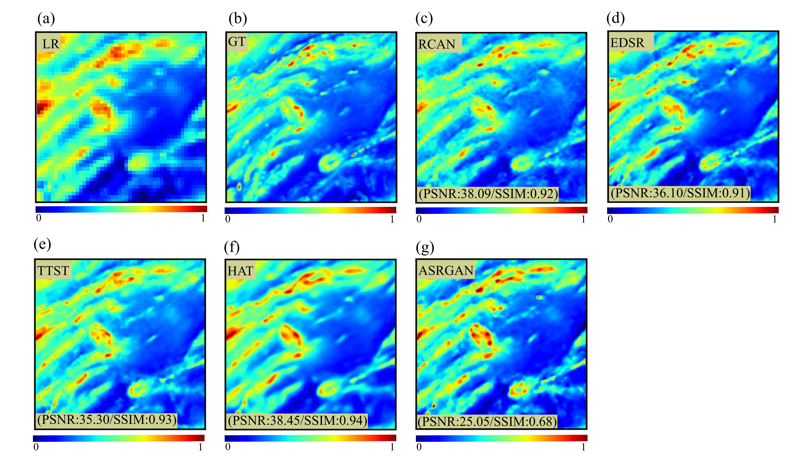
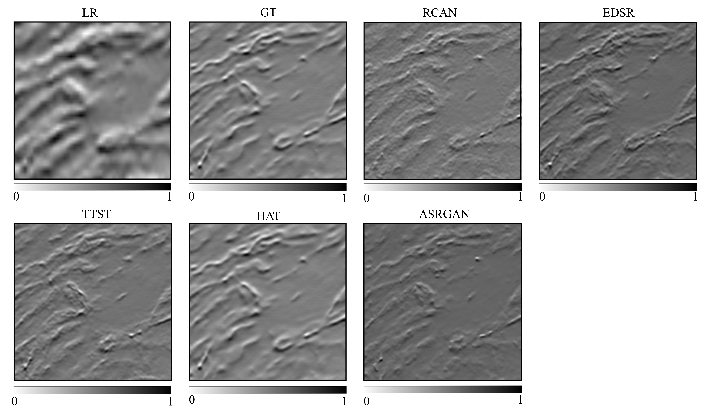

# High-Resolution Aeromagnetic Mapping Using CNN and Transformer-Based Super-Resolution

This repository is partially based on the original TTST implementation  
(https://github.com/XY-boy/TTST), with modifications and extensions for aeromagnetic data super-resolution.

## 📌 Overview
The objective of this work is to enhance the spatial resolution of aeromagnetic data using deep learning–based super-resolution techniques, with a focus on CNN and Transformer architectures. Aeromagnetic surveys are widely used in geophysical exploration, but their spatial resolution is often limited by acquisition constraints.  

In this study, we investigate learning-based super-resolution methods to reconstruct high-resolution aeromagnetic maps from low-resolution data.

Unlike GAN-based approaches, which often suffer from limited generalization in geophysical applications, we focus on deterministic architectures combining convolutional neural networks and attention mechanisms.

## 🧠 Models
Pretrained weights are available — [use this link](https://drive.google.com/drive/folders/17e45K1_xm5vrZw0b6y_PTFlrDWscvDN9?usp=drive_link).

The following architectures have been implemented or adapted for super-resolution tasks:

| Model | Architecture Type | Key Mechanism |
|------|------------------|---------------|
| EDSR | CNN-based | Deep residual learning |
| RCAN | CNN-based with attention | Channel attention mechanism |
| HAT | Transformer-based | Hierarchical self-attention |
| TTST | Transformer-based | Two-stage transformer architecture |

## 🗂️ Dataset
The dataset is available — [use this link](https://drive.google.com/drive/folders/19a-Bpz9kPClxSC7QWmHmOlfvDWSmZaX_?usp=drive_link).

This dataset contains high-resolution (GT) and low-resolution (LR) aeromagnetic data in PNG format. All images are paired for training and evaluation.

The dataset is organized into two main subfolders:

| Folder | Description |
|--------|-------------|
| `GT/`  | Ground Truth images (high-resolution) |
| `LR/`  | Low-Resolution images |

Each folder contains images following a consistent naming convention: `001_GT.png`, `001_LR.png`, etc.

### Environment
- CUDA 11.1  
- Python 3.9.13  
- PyTorch 1.9.1  
- Torchvision 0.10.1  
- basicsr 1.4.2  

## Training and Evaluation 
Change all the paths in `train_4x.py` to your local path, then run `train_4x.py` or `eval_4x.py`.

### Quick Test
A complete Google Colab notebook is provided for end-to-end usage.
Simply run all cells sequentially. The pipeline includes:
* Training the model
* Evaluating the model
* Displaying qualitative results
A complete Google Colab notebook is provided for end-to-end usage.

Simply run all cells sequentially. The pipeline includes:
* Training the model
* Evaluating the model
* Displaying qualitative results
👉 Download the ESDR dataset:  
[ESDR Dataset (Google Drive)](https://drive.google.com/drive/folders/1DiKAkQNADkA6aAaiXLocqEcvjCKOmIYj?usp=drive_link)

After downloading, extract the dataset and update the dataset path in the notebook to match your local environment.

👉 Open the notebook here:  
[Google Colab Notebook](https://colab.research.google.com/drive/1JEztWRbOMtj6G5kwKci_qsdDrkgTe61Y)

Just run all cells sequentially.

For comparison with ASRGAN, we refer to the following repository: https://github.com/MBS1984/Adapted-SRGAN

## 🖼️ Results
Results are available — [use this link](https://drive.google.com/drive/folders/17dp1fsmQQbCXO7lLyrE3mnsWhWYvBfn7?usp=drive_link).

### Aeromagnetic map 

### Example of generated maps from different models

### Vertical derivation

### Loss

### Cross-plot
